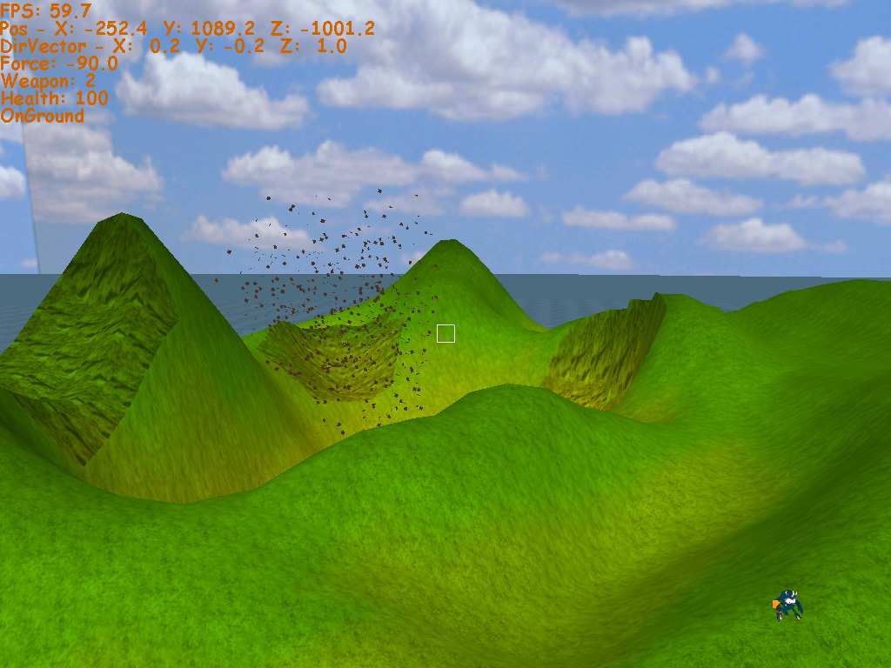

# VERY OLD: Terrain engine demo (worms3d attempt)

One of those very old projects from around the early 2000s where I used to program 3d game stuff with C++ on Windows. Unfortunately I can neither build nor run this anymore, since I think it requires a Windows version before NT and the Visual C++ 5 or 6 IDE.

It is a terrain engine with OpenGL where you can shoot and it has deformable geometry.